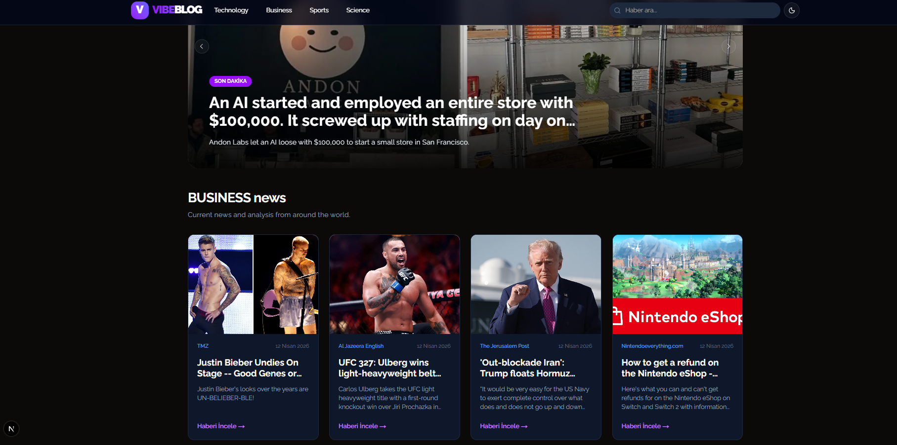
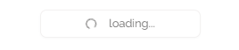
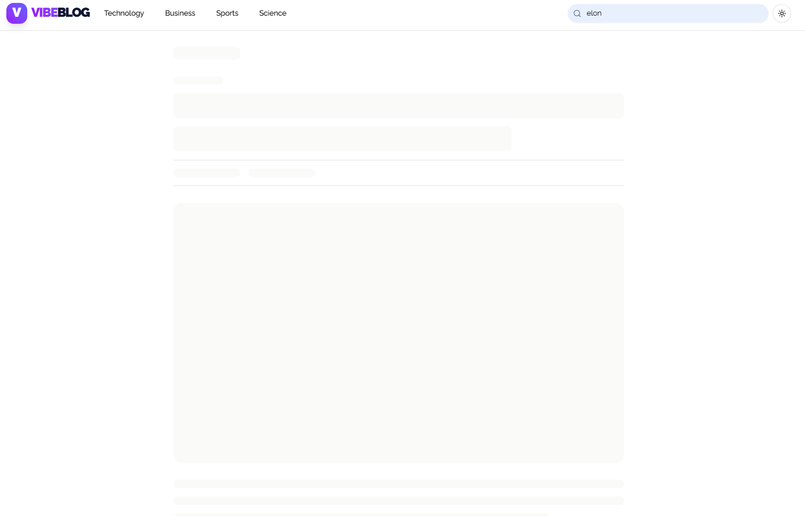
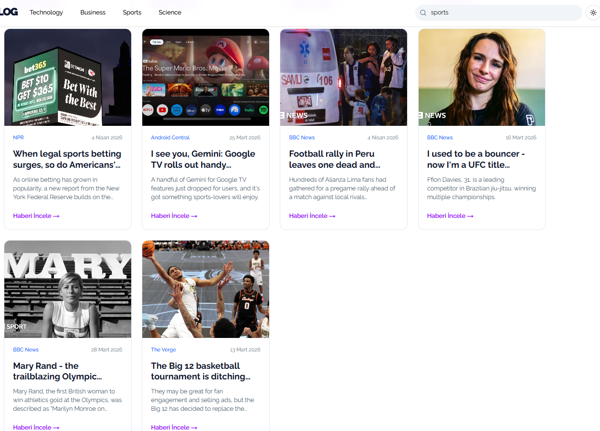

# ⚡ VibeBlog - Next Generation News Platform


VibeBlog is a modern **Next.js** application designed to keep up with the current world. Powered by NewsAPI, the platform provides real-time data flow, a seamless user experience (UX), and a fully responsive interface. It is not just a news reading tool, but also a showcase of modern web engineering practices (SSR, URL-based state management, Error Boundaries).

-----

## 📍 Table of Contents

- [🚀 Features](#-features)
- [🛠️ Tech Stack](#️-tech-stack)
- [🎥 Demo & Screenshots](#-demo--screenshots)
- [🏗️ Architecture & Performance](#️-architecture--performance)
- [📦 Installation & Setup](#-installation--setup)
- [🔗 Contact](#-contact)

-----

## 🚀 Features

- **Dynamic Search & Filtering:** Search news within seconds and easily share results with URL-based state management.
- **Hero Carousel:** A visually engaging, auto-sliding "Breaking News" section on the homepage.
- **Hybrid Loading (Load More):** Continuous news flow using both server-side and client-side fetching strategies without interrupting user experience.
- **Modern UI/UX & Theme:** Built with Shadcn/UI and Tailwind CSS, featuring smooth Dark/Light mode support.
- **Dynamic Routing:** Clean and SEO-friendly pages for each news article (`/news/[title]`).

## 🛠️ Tech Stack

- **Framework:** Next.js 16 (App Router)
- **Language:** TypeScript
- **Styling:** Tailwind CSS
- **UI Components:** Shadcn/UI & Radix UI
- **Theme Management:** Next-Themes
- **API:** NewsAPI

## 🎥 Demo & Screenshots
### Live Preview


---
[Live Link](https://vibe-blog-app.vercel.app/) 

### Application Screenshots

| Light mode | Loading (Skeleton) & Error | Category & Search Experience |
|---|---|---|
|  |  |  |

## 🏗️ Architecture & Performance

The application is designed to be resilient and high-performance:

- **Image Fallback Strategy:** Maintains UI consistency against broken or missing API images using `onError` handling.
- **Loading and Error States:** Prevents blank screens with page-level and component-level `Skeleton` loaders and `error.tsx` error boundaries.
- **URL-Based State:** Uses URL parameters instead of client memory for search and filtering, ensuring full SEO compatibility and improved browser navigation (back/forward support).
- **Caching:** Optimized data fetching using Next.js `revalidate` strategy to protect external API limits.

## 📦 Installation & Setup

Follow these steps to run the project locally:

1. **Clone the repository:**

```bash
git clone https://github.com/kasimugur/vibeblog.git
cd vibeblog
````

2. **Install dependencies:**

```bash
npm install
```

3. **Set environment variables:**

Create a `.env.local` file in the root directory and add your NewsAPI key:

```env
NEWS_API_KEY=your_api_key_here
```

4. **Run the development server:**

```bash
npm run dev
```

Open `http://localhost:3000` in your browser to view the app.

---

# 🔗 Contact

**Developer:** Kasım Uğur
GitHub: [https://github.com/kasimugur/](https://github.com/kasimugur/)
LinkedIn: [https://www.linkedin.com/in/kasimugur/](https://www.linkedin.com/in/kasimugur/)


